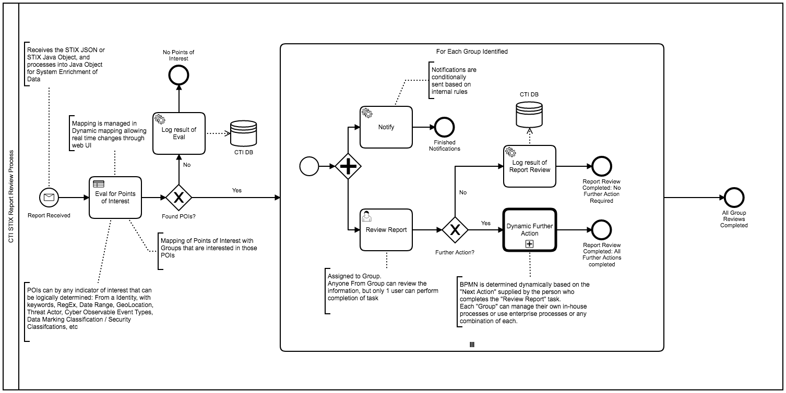

# Charon

:exclamation: THIS IS A ACTIVE WORK IN PROGRESS: NOT PRODUCTION READY :exclamation:

# STIX 2.x Java Library

The libary aims to provide a flexible full implementation of [STIX 2.x](https://oasis-open.github.io/cti-documentation/resources#stix-20-specification).  
This means that a default implementation is provided that meets the STIX JSON specification and the core objects 
and properties are provided in such a way as you can easily override any implementation detail to meet your 
variation of the specification.

## Usage

There are two primary purposes of usage: 
1. create STIX Java Objects (Through code or conversion from a string of STIX JSON) and,
2. convert STIX Java objects into JSON that is STIX Spec compliant.

## Java

```java
// Generate Attack Pattern:
AttackPattern attackPattern = new AttackPattern("some pattern");
attackPattern.setKillChainPhases(
        new KillChainPhase("Chain1", "phase1"),
        new KillChainPhase("Chain1", "phase2"));

attackPattern.setModified(attackPattern.getCreated().plusDays(3));

// Setup Custom properties for Attack Pattern:
HashMap<String, Object> customProperties = new HashMap<>();
customProperties.put("someCustomKey", "My custom value");
customProperties.put("someOtherCustom_key", 3939);
attackPattern.setCustomProperties(customProperties);

// Setup Marking Definitions for Attach pattern
MarkingDefinition markingDefinition = new MarkingDefinition(
        new TlpMarking("white"));

MarkingDefinition refDef = new MarkingDefinition(
        new TlpMarking("red"));

// Apply a Object level Marking
attackPattern.addObjectMarkingRefs(markingDefinition);
// Create a Granular Marking
GranularMarking granularMarking =
        new GranularMarking(refDef, "pattern1", "pattern2", "pattern3");

// Apply a Granular Marking to the attack pattern
attackPattern.addGranularMarkings(granularMarking);


MarkingDefinition statement1 = new MarkingDefinition(
        new StatementMarking("Internal review of data allows for sharing as per ABC-009 Standard"));

GranularMarking markingRestriction =
        new GranularMarking(refDef, "marking-pattern1", "pattern2", "pattern3");

statement1.addGranularMarkings(markingRestriction);

markingDefinition.addObjectMarkingRefs(statement1);

// Generate Observed Data Object:
ZonedDateTime observedTime = ZonedDateTime.now();
HashMap<String, CyberObservableObject> cyberObservedObjects = new HashMap<>();
cyberObservedObjects.put("some artifact",
        new Artifact(){{setUrl("someURL");}}
        );

cyberObservedObjects.put("some AS",
        new AutonomousSystem(5){{setRir("someRIR");}}
);

ObservedData observedData = new ObservedData(observedTime, observedTime, 3, cyberObservedObjects);

observedData.addObjectMarkingRefs(statement1);


// Generate Bundle.  You must add at least 1 item into the bundle.
Bundle bundle = new Bundle(attackPattern);

// Add some additional items into the bundle:
bundle.addObjects(observedData);


// Build Identity

Identity steve = new Identity("Stephen", "individual");
attackPattern.addTarget(steve);


// Add a Sighting that is related to attackPattern
// and has a Object Marking of redDef
Sighting someSighting = new Sighting(attackPattern);

AttackPattern ap2 = new AttackPattern("someOtherATTK2");
someSighting.setWhereSightedRefs(new LinkedHashSet<>(Arrays.asList(steve)));
bundle.addObjects(someSighting);
someSighting.setSightingOfRef(ap2);


// Auto add Data Markings into the Bundle.  This is a helper method that will search all objects in
// the bundle that can contain Data Markings and add the Data Marking objects as top level items in the Bundle
// This saves you the effort of having to manually adding the Data markings into the bundle.
bundle.autoDetectBundleObjects();

bundle.toJsonString();
```

All Objects have support for `.toJsonString()`; allowing any STIX related object to be individually exported into JSON.

## JSON

The below is a the output from the java example above.

```json
{
  "type": "bundle",
  "id": "bundle--42e53388-901f-4946-987f-03120f1e3afe",
  "spec_version": "2.0",
  "objects": [
    {
      "type": "attack-pattern",
      "id": "attack-pattern--848bb766-1bda-4260-9641-5258149f4e32",
      "created": "2018-11-23T17:32:17.569Z",
      "modified": "2018-11-26T17:32:17.569Z",
      "revoked": false,
      "object_marking_refs": [
        "marking-definition--e8bd2c7c-6a37-4740-972e-5ab3d70e6025"
      ],
      "granular_markings": [
        {
          "selectors": [
            "pattern1",
            "pattern2",
            "pattern3"
          ],
          "marking_ref": "marking-definition--f0f7dbea-4327-42a5-8264-65417876b0e1"
        }
      ],
      "name": "some pattern",
      "kill_chain_phases": [
        {
          "kill_chain_name": "Chain1",
          "phase_name": "phase1"
        },
        {
          "kill_chain_name": "Chain1",
          "phase_name": "phase2"
        }
      ],
      "x_someCustomKey": "My custom value",
      "x_someOtherCustom_key": 3939
    },
    {
      "type": "observed-data",
      "id": "observed-data--3c82215c-5f4f-40a1-8052-cc8d9cbd3fbd",
      "created": "2018-11-23T17:32:17.635Z",
      "modified": "2018-11-23T17:32:17.635Z",
      "revoked": false,
      "object_marking_refs": [
        "marking-definition--df989440-58ff-4c9f-9bdb-6b68a7b959f5"
      ],
      "first_observed": "2018-11-23T17:32:17.621Z",
      "last_observed": "2018-11-23T17:32:17.621Z",
      "number_observed": 3,
      "objects": {
        "some artifact": {
          "type": "artifact",
          "url": "someURL"
        },
        "some AS": {
          "type": "autonomous-system",
          "number": 5,
          "rir": "someRIR"
        }
      }
    },
    {
      "type": "sighting",
      "id": "sighting--5251b370-c71c-449e-b6a6-9f87a5efba94",
      "created": "2018-11-23T17:32:17.660Z",
      "modified": "2018-11-23T17:32:17.660Z",
      "revoked": false,
      "sighting_of_ref": "attack-pattern--635c486f-f1b3-4975-8264-434b5fc17cb8",
      "where_sighted_refs": [
        "identity--c1268e7b-9d40-4386-b6c0-f258d9ea7bdc"
      ],
      "summary": false
    },
    {
      "type": "marking-definition",
      "id": "marking-definition--df989440-58ff-4c9f-9bdb-6b68a7b959f5",
      "created": "2018-11-23T17:32:17.618Z",
      "granular_markings": [
        {
          "selectors": [
            "marking-pattern1",
            "pattern2",
            "pattern3"
          ],
          "marking_ref": "marking-definition--f0f7dbea-4327-42a5-8264-65417876b0e1"
        }
      ],
      "definition_type": "statement",
      "definition": {
        "statement": "Internal review of data allows for sharing as per ABC-009 Standard"
      }
    },
    {
      "type": "marking-definition",
      "id": "marking-definition--f0f7dbea-4327-42a5-8264-65417876b0e1",
      "created": "2018-11-23T17:32:17.612Z",
      "definition_type": "tlp",
      "definition": {
        "tlp": "red"
      }
    },
    {
      "type": "relationship",
      "id": "relationship--d9ef44c0-a665-4c41-b378-3f3f98bf4992",
      "created": "2018-11-23T17:32:17.651Z",
      "modified": "2018-11-23T17:32:17.651Z",
      "revoked": false,
      "relationship_type": "targets",
      "source": "attack-pattern--848bb766-1bda-4260-9641-5258149f4e32",
      "target": "identity--c1268e7b-9d40-4386-b6c0-f258d9ea7bdc"
    },
    {
      "type": "attack-pattern",
      "id": "attack-pattern--635c486f-f1b3-4975-8264-434b5fc17cb8",
      "created": "2018-11-23T17:32:17.660Z",
      "modified": "2018-11-23T17:32:17.660Z",
      "revoked": false,
      "name": "someOtherATTK2"
    },
    {
      "type": "identity",
      "id": "identity--c1268e7b-9d40-4386-b6c0-f258d9ea7bdc",
      "created": "2018-11-23T17:32:17.646Z",
      "modified": "2018-11-23T17:32:17.646Z",
      "revoked": false,
      "name": "Stephen",
      "identity_class": "individual"
    }
  ]
}
```

# Workflow / BPM / BPMN

## Example Process Usage





-----

This project is a packaging of multiple components that will be split into individual projects at some point.

1. A full [CTI STIX](https://oasis-open.github.io/cti-documentation/) (Structured Threat Information Expression Language) Java8 implementation. (`io.digitalstate.stix`).  The goal is for flexibility and reuse by other Java projects.
1. Charon Application ("Charon Server"):
    1. A SpringBoot based instance of [Camunda BPM](https://docs.camunda.org/manual/7.9/)
    1. Possible: A [TAXII](https://oasis-open.github.io/cti-documentation/taxii/intro) server implemented in SpringBoot, tied to the Camunda BPM SpringBoot instance.
    1. A bridge of CTI STIX with Camunda BPM BPMN Java-Delegates and Scripting Usage.
    1. Possible: Mongo Spring Data Mapping from the STIX Java8 implementation to Mongo Documents.
    1. Possible: Additional REST APIs in addition to the TAXII API that provide missing functionality that is available from using Camunda.
    1. Monitoring of BPMN and STIX data usage with [Prometheus Camunda Plugin](https://github.com/StephenOTT/camunda-prometheus-process-engine-plugin) 
    

**Overall Concept:** Enable organizations working with CTI and STIX to have the "application" 
(Charon) easily adapt to the organizations internal or standardized security processes.  
An organization should not have to change their security models for a "vendor".

Example Use Cases:
1. STIX Bureaucracy Management using Charon.
1. Security Approvals and Revocations for STIX data exposed through TAXII.
1. Managing TAXII "Hubs" / Central Databases and the review, adjustements, and approvals of submissions of data into the Charon / STIX DB.
1. Life-cycling STIX data through BPMN.
1. Managing TAXII / STIX data access requests, apply-and-removal of STIXX markings.
1. Multi-Department STIX Data Isolation with STIX data submission to UpStream STIX datasource.
1. Execute automated and manual workflows based on STIX data events (CRUD events in STIX data). 
1. Concept of "Shareable Workflows":
    1. Ability to share common business and technical workflows across a single organization and across many organiztions.
    1. Ability to create Executable Workflows based on data events within STIX data.
    